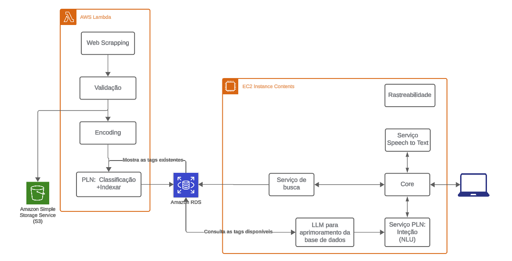

# Proposta de Aprendizado Contínuo

👩‍🎓 Aluna/Autora: Paula Zanella Piva

👨‍🏫 Professor: Victor Hayashi

## 📝 Detalhamento

O projeto CORA, desenvolvido para o Bank of America, visa a captação de LRRs (Leis, Regulamentos e Resoluções) para automatizar o acompanhamento das mudanças regulatórias brasileiras, proporcionando o monitoramento, classificação, exibição e pesquisa das informações.

O projeto é dividido em 3 etapas:
**1.** Coleta de LRRs com web scraping;
**2.** Tagueamento das LRRs com LLM ( Large Language Model);
**3.** Exibição e pesquisa por áudio ou texto através de PLN.

Atualmente, o sistema enfrenta o desafio de não conseguir se manter atualizado com as novas informações que surgem diariamente. Dessa forma, ele rapidamente se torna obsoleto, pois não consegue se adaptar à dinâmica das novas informações em tempo real.

Esse problema está relacionado ao conceito de concept drift, que ocorre quando os padrões dos dados mudam ao longo do tempo, impactando o desempenho do modelo. No caso da CORA, o concept drift se manifesta quando novas tags são introduzidas ou removidas, alterando a dinâmica do tagueamento e da pesquisa¹ ².

Para lidar com esse problema, é necessário implementar um mecanimo de aprendizado contínuo que permita a atualização constante dos modelos, incorporando novos dados e tags³. Estudos como o de Parisi et al. (2019) sobre "Lifelong Learning" reforçam a importância do aprendizado contínuo para sistemas que lidam com grandes quantidades de dados dinâmicos, especialmente no campo de PLN, onde os modelos precisam se adaptar constantemente a novos padrões⁴.

## Solução Proposta

Para implementar o aprendizado contínuo no sistema, a arquitetura pode ser adaptada da seguinte maneira:

Diagrama

**1. Coleta de LRRs (Web Scraping, validação, encoding)**

Esse módulo já existe e é responsável por coletar as LRRs de fontes externas diariamente. Após a coleta, as LRRs passam por um processo de validação para garantir a integridade e a precisão dos dados. Em seguida, os dados são codificados para transformar o texto bruto em uma forma que possa ser utilizada pelos módulos subsequentes.

O fluxo de dados neste módulo é:

Web Scraping: Captura de dados de sites externos.
Validação: Verificação e correção dos dados coletados.
Encoding: Conversão dos dados para o formato adequado para processamento.

**2. Banco de dados**
O módulo de banco de dados será aprimorado para rastrear e armazenar as alterações realizadas pelos usuários, como adição e remoção de tags. Essas mudanças permitirão que o sistema atualize o modelo de tagueamento e o PLN com base no feedback contínuo dos usuários.

**3. Tagueamento de LRRs (LLM)**

O módulo de tagueamento utiliza um LLM para ler as LRRs coletadas e gerar automaticamente as tags que melhor representam o conteúdo dos documentos. O módulo precisará ser atualizado para ter as seguintes funcionalidades:

**A. Geração automática de tags**: O LLM continuará a gerar tags automaticamente, tentando representar os principais temas ou tópicos de uma LRR.

**B. Integração com tags manuais**: O sistema será aprimorado para aproveitar as tags já criadas pelos usuários, refinando o processo de tagueamento. Isso inclui tanto as tags que os usuários adicionaram quanto as que foram removidas ao longo do tempo. Tags frequentemente aceitas serão sugeridas como opções potenciais no processo de novo tagueamento, melhorando a precisão do LLM.

**C. Ajuste dinâmico do modelo**: O módulo de tagueamento deve ser atualizado regularmente com base nas tags adicionadas ou removidas pelos usuários. Isso permitirá que o sistema identifique tags que foram mais removidas pelos usuários e ajuste o LLM para não priorizá-las nos tagueamento futuros.

**4. Aprendizado Contínuo**
Esse é o bloco em que o modelo BERT será atualizado regularmente, com base nas novas tags e alterações feitas pelos usuários. Com base nas tags adicionadas ou modificadas, serão geradas novos exemplos de frase, por meio de LLM, para a base de treinamento do modelo. 

O processo de atualização ocorrerá de maneira recursiva:

 A. Quando um usuário adiciona uma nova tag a uma LRR, o sistema gera novas frases que representem exemplos de uso dessa tag.

 B. Essas frases são incorporadas ao banco de dados de frases associadas ao modelo BERT, permitindo que ele reconheça novas intenções ou entidades nas consultas.

 C. O modelo BERT será atualizado incrementalmente, evitando o retrabalho completo, mas ajustando-se às mudanças para melhorar continuamente a acurácia das consultas.

**5. Processamento de Linguagem Natural (PLN): Classificação**
 O módulo de PLN e classificação é responsável por analisar e interpretar as LRRs e as consultas dos usuários. Ele utiliza o modelo BERT para identificar as intenções e entidades nas consultas e classificar as LRRs de acordo com as tags associadas.

**6. Serviço de Busca**
O módulo de serviço de busca facilita a recuperação de informações do banco de dados com base intenção dos usuários. 

**7. Core**
O Core atua como a peça central que conecta todos os outros módulos. Ele coordena o fluxo de dados entre os diferentes módulos, garantindo que as informações sejam processadas corretamente, e gerencia as requisições de serviços.

**8. Speech to Text**
O módulo Speech to Text converte entradas de áudio em texto, sendo usado para transformar consultas feitas por voz em um formato que possa ser processado pelo sistema.

## Conclusão
A proposta de introduzir aprendizado contínuo no projeto CORA visa resolver os desafios do concept drift, mantendo o sistema sempre atualizado. Essa solução aprimora a precisão do tagueamento e a qualidade das consultas no sistema de PLN, permitindo que o BERT reconheça novas intenções e entidades de forma mais eficiente Embora a implementação exija um esforço considerável, tanto em termos de desenvolvimento quanto de infraestrutura, o retorno em termos de precisão será significativo, garantindo a eficiência da CORA a longo prazo.

## 📚 Referências
1. ZHAO, H.; LIU, X.; LIU, J. A Survey of Concept Drift Detection Methods. IEEE Xplore, 2020. Disponível em: https://ieeexplore.ieee.org/document/9154715. Acesso em: 15 set. 2024.

2. BERTAN, E. O que é concept drift em machine learning? Medium, 22 mar. 2021. Disponível em: https://medium.com/@ericabertan/o-que-é-concept-drift-em-machine-learning-40ae3c4f0b67. Acesso em: 15 set. 2024.

3. DATA CAMP. What is Continuous Learning? DataCamp, 19 jun. 2023. Disponível em: https://www.datacamp.com/pt/blog/what-is-continuous-learning. Acesso em: 16 set. 2024.

4. PARISI, G. I., KEMKER, R., PART, J. L., KANNAN, A., & WERMTER, S. Continual lifelong learning with neural networks: A review. Neural Networks, v. 113, p. 54-71, 2019.